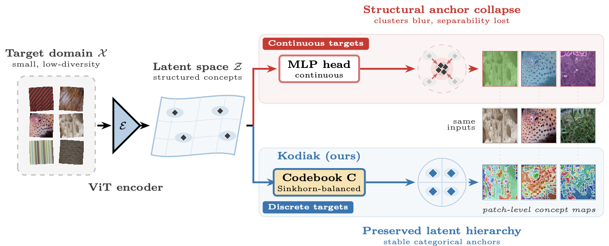
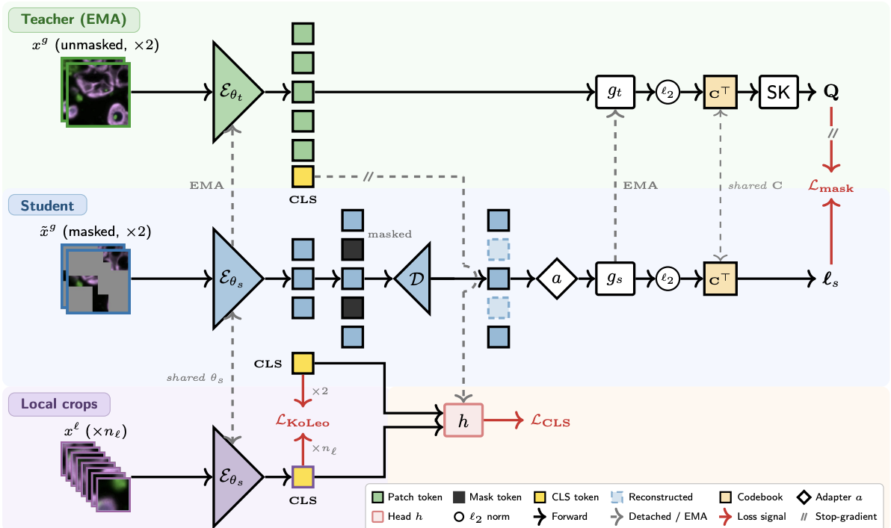

<div align="center">

# KODIAK

**Drift-free adaptation of vision foundation models to new imaging domains, with discrete codebook distillation on unlabelled images**

[](https://github.com/marjanstoimchev/KODIAK/actions/workflows/ci.yml)
[](LICENSE)
[](https://www.biorxiv.org/content/10.64898/2026.10.03.756431v1)
[](https://www.python.org/)
[](https://lightning.ai/)

[Quick start](docs/QUICKSTART.md) ·
[How it works](docs/METHOD.md) ·
[Experiments](docs/EXPERIMENTS.md) ·
[Datasets](docs/DATASETS.md) ·
[Ablations](docs/ABLATIONS.md) ·
[CLI reference](docs/CLI.md) ·
[Development](docs/DEVELOPMENT.md)

</div>

---

**The problem: representation drift.** Continuing self-supervised training of a vision foundation model (DINOv3,
MAE, ...) on a small, specialised dataset, for example a few thousand histopathology or satellite images, is
supposed to adapt the model. In practice it often does the opposite: the continuous feature targets of standard
self-distillation are weakly constrained, so the teacher *drifts*, the geometric structure of the pretrained
representation is distorted, and downstream accuracy drops below the un-adapted foundation model.

<p align="center">
  
</p>
<p align="center"><em>Same encoder, same inputs. With continuous targets the latent clusters blur and separability is lost (top); KODIAK's Sinkhorn-balanced codebook anchors the representation on stable discrete concepts and yields patch-level concept maps (bottom).</em></p>

**What KODIAK does.** KODIAK (**KO**debook **DI**stillation for **A**daptation) replaces continuous targets with
a **discrete vocabulary of visual concepts**: a learnable codebook whose Sinkhorn-balanced assignments the student
must predict for masked patches and across crops. Predicting categorical assignments instead of regressing
high-dimensional features anchors the representation on reusable prototypes, so the foundation model is adapted
to the domain **without drifting away from what it already knows**. The paper measures this directly with
layer-wise CKA: drift stays around 0.1 with KODIAK versus about 0.5 with standard self-distillation. The learned
codebook entries are also interpretable: each maps to a spatially coherent visual concept, giving concept maps
for cell phenotyping, tissue-niche discovery or materials characterisation on top of classification and
retrieval.

This is the official PyTorch Lightning implementation of

> **Discovering Latent Scientific Concepts through Discrete Representation Learning**
> M. Stoimchev, M. Verma, A. Filliol, M. Skamagki, S. Flowers, J. Cohen, Z. Azadian, N. Newlin,
> M. S. Abdel-Mottaleb, S. Dzeroski, P. B. Romesser, S. Lowe, N. Dimitrova
> *Discovery Science (DS 2026)*, LNCS, Springer · [bioRxiv preprint](https://www.biorxiv.org/content/10.64898/2026.10.03.756431v1)

<p align="center">
  
</p>
<p align="center"><em>The EMA teacher maps unmasked global crops to Sinkhorn-balanced codebook targets <b>Q</b>; the student encodes masked crops, reconstructs the patch grid with decoder <b>D</b> and adapter <b>a</b>, and predicts codebook logits at masked positions. Head <b>h</b> aligns CLS tokens across views; local crops add uniformity signals.</em></p>

## Highlights

- **Drift-free adaptation**: discrete, Sinkhorn-balanced codebook targets preserve the pretrained representation
  during continued self-supervised learning; unlabelled domain images are enough.
- **Single-stage and DINO-compatible**: teacher-student with EMA, multi-crop, no external tokenizer.
- **Three losses**: masked codebook prediction (core), cross-view CLS alignment, KoLeo uniformity.
- **Interpretable codebook**: each entry is a reusable visual concept; concept maps come for free.
- **Two regimes**: continued pretraining from DINOv3 weights, or training from scratch.
- **Four evaluation protocols** built in: fine-tuning, linear probing, k-NN, few-shot.
- **Runs anywhere**: single GPU, multi-GPU DDP, SLURM + Singularity; tested on CPU in CI.

## Install and run in three commands

```bash
pip install torch torchvision && pip install -r requirements.txt

# 1. adapt DINOv3 to EuroSAT (unlabelled)         -> checkpoints/pretraining/eurosat/<exp>/last.ckpt
python scripts/train.py --config configs/eurosat/pretrain_continued.yaml --devices 0 --max_epochs 100

# 2. fine-tune a classifier on the adapted encoder -> logs/classification/eurosat/<exp>/finetune_seed_0/test_results.json
python scripts/train_classifier.py --config configs/eurosat/classify.yaml --pretrained_path checkpoints/pretraining/eurosat --devices 0
```

Add `--freeze_backbone` for a linear probe, use `scripts/eval_knn.py` / `scripts/eval_lowshot.py` for k-NN and
few-shot evaluation, and point `--root_dir` at a folder of `class/image.png` to use your own images.
The [quick start](docs/QUICKSTART.md) walks through all of this.

## Documentation

| | |
|---|---|
| [Quick start](docs/QUICKSTART.md) | Installation, smoke test, pretrain → classify → evaluate, your own images, where results go |
| [How it works](docs/METHOD.md) | The method in one page: losses, architecture, which losses to use when |
| [Experiments](docs/EXPERIMENTS.md) | Every experiment from the paper as copy-paste commands (local and SLURM) |
| [Datasets](docs/DATASETS.md) | The 7 supported datasets and how to add one |
| [Ablations](docs/ABLATIONS.md) | Component ablations and the codebook-size sweep |
| [CLI reference](docs/CLI.md) | All flags of every script and all config keys |
| [Development](docs/DEVELOPMENT.md) | Tests, lint, CI, project layout |

## Citation

```bibtex
@inproceedings{Stoimchev26,
  author    = {Stoimchev, Marjan and Verma, Monu and Filliol, Aveline and Skamagki, Maria and Flowers, Sara and Cohen, Jacob and Azadian, Zachary and Newlin, Nancy and Abdel-Mottaleb, Mohamed Saeed and Dzeroski, Saso and Romesser, Paul B. and Lowe, Scott and Dimitrova, Nevenka},
  title     = {Discovering Latent Scientific Concepts through Discrete Representation Learning},
  booktitle = {Discovery Science (DS 2026)},
  series    = {Lecture Notes in Computer Science},
  publisher = {Springer},
  address   = {Mainz, Germany},
  year      = {2026},
  month     = oct
}
```

## License

Code is released under the [MIT License](LICENSE). The vendored DINOv3 library (`dinov3/`) and the weights in
`dinov3_weights/` are distributed under the [DINOv3 License Agreement](dinov3/LICENSE.md).
