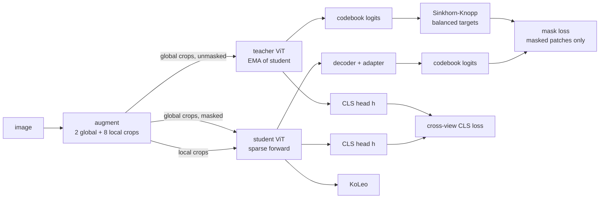

# How KODIAK works

## The problem: representation drift

The obvious way to specialise a self-supervised foundation model (DINOv3, MAE, I-JEPA, ...) to a new imaging
domain is to keep training it with its own objective on the domain images. With only a few thousand images this
is fragile. Standard self-distillation asks the student to regress the teacher's *continuous* feature vectors; with
little data diversity those targets are weakly constrained, the EMA teacher slowly drifts, and the geometry of the
pretrained representation is distorted. The paper shows this directly: on DTD and Oxford-Pets, continued DINOv3
pretraining *lowers* fine-tuning accuracy by 6 to 9 points, and layer-wise CKA between the adapted and the
original model shows large drift (about 0.5) concentrated in the mid-to-late transformer layers.

## The idea: discrete, balanced codebook targets

**KODIAK** (**KO**debook **DI**stillation for **A**daptation) keeps the DINO teacher-student protocol but changes
the *target space*. The student predicts assignments to a learnable **codebook** of `K` prototype vectors
(default `K = 128`) instead of regressing features. Two properties make this stable:

- **Discrete bottleneck.** A `K`-way categorical decision has far fewer degrees of freedom than a 384-dimensional
  regression target, which limits how far the representation can move to fit surface statistics of a small dataset.
- **Sinkhorn-Knopp balancing.** Teacher assignments are balanced across the codebook within each batch, so all
  prototypes stay in use and the codebook cannot collapse to a handful of entries.

The result is adaptation that improves the foundation model on every dataset in the paper while keeping CKA
drift around 0.1, and a codebook whose entries are interpretable, spatially coherent visual concepts.

Data flow, simplified:

Two copies of the same ViT encoder are trained: a **student** (updated by gradient descent) and a **teacher**
(an exponential moving average of the student). Every training image is augmented into 2 large *global* crops and
8 small *local* crops. A learnable **codebook** of `K` prototype vectors (default `K = 128`) defines the discrete
target space; the teacher assigns every patch to codebook entries, and **Sinkhorn-Knopp** balancing makes sure all
entries stay in use.

| Loss | What it teaches |
|------|-----------------|
| **Mask loss** (core) | Patches of a global crop are hidden from the student (MAE-style sparse encoder + small decoder). For each hidden patch the student must predict the teacher's balanced codebook assignment, i.e. *which visual concept* was there. |
| **Cross-view CLS loss** | The image-level CLS token of every crop (global and local) is mapped by a small MLP head to a `K`-way distribution and must match the teacher's distribution for the global crops, so local details and the whole image agree. |
| **KoLeo** | Spreads CLS features apart in representation space so they do not collapse. |

Total loss: `L = L_mask + λ_CLS · L_CLS + λ_KoLeo · L_KoLeo` with `λ_CLS = 1.0`, `λ_KoLeo = 0.1`.

**Which losses to use.** The paper's ablations give a simple recipe: use the full objective when pretraining
**from scratch** (dropping the CLS or KoLeo loss costs up to 24 points on DTD), but when **adapting the DINOv3
foundation model** the mask loss alone carries the gain and the auxiliary losses are optional
(`--cls_weight 0 --koleo_weight 0`). Performance is robust to the codebook size (`K` from 64 to 4096).

Everything is configured through one YAML file per dataset and a handful of command-line flags.

## Architecture

| Component | Setting |
|-----------|---------|
| Encoder (teacher and student) | DINOv3 ViT-S/16: dim 384, 12 blocks, 6 heads, RoPE, 4 register tokens, LayerScale, drop-path 0.1 |
| Masking | MAE-style sparse student forward; block masking, ratio sampled in [0.1, 0.5] per image |
| Decoder (student only) | 4 transformer blocks, dim 192, learnable position embedding + LayerNorm/Linear adapter back to 384 |
| Patch projectors | 3-layer MLP 384 → 2048 → 2048 → 256, L2-normalised |
| Codebook | `K` × 256 learnable prototypes (default `K = 128`), shared by teacher and student |
| CLS head | 3-layer MLP 384 → 2048 → 2048 → `K`, shared by teacher and student |
| Teacher update | EMA, momentum 0.992 → 1.0 (scratch) or 0.996 → 1.0 (continued) |

Where this lives in the code: [`src/models/kodiak.py`](../src/models/kodiak.py) (teacher/student/codebook),
[`src/models/components.py`](../src/models/components.py) (encoder, decoder, projector),
[`src/losses/`](../src/losses/) (mask loss + Sinkhorn, CLS loss, KoLeo),
[`src/learners/pretraining.py`](../src/learners/pretraining.py) (schedules and optimizer).

See [ABLATIONS.md](ABLATIONS.md) for the component ablations and the codebook-size sweep.
